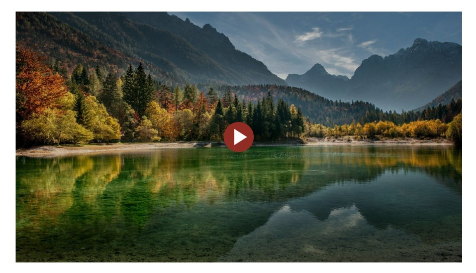
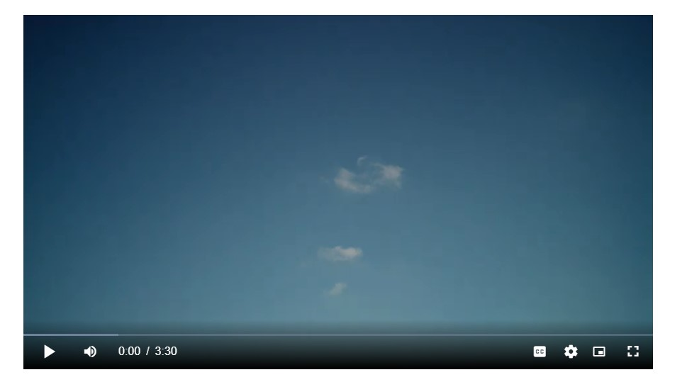
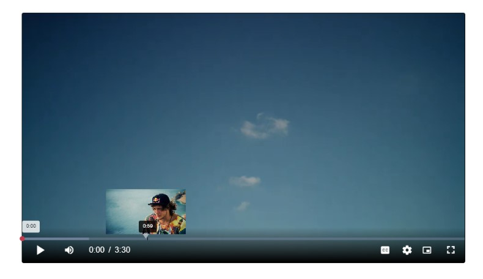
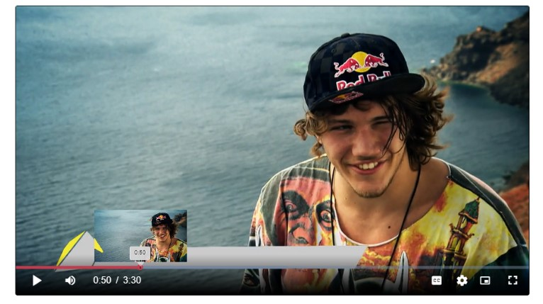
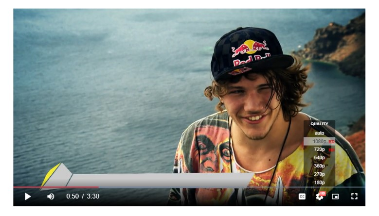

# Video.js YouTube Custom Skin
This is Video.js Custom Skin With Thumbnails on Hovering On Progress Bar
This is all the source files of the project inclouding sass files
# Test it stream here [here](https://app.netlify.com/sites/happy-lewin-ec7996/overview)
## Usage
You will find all the plugins files that used to build this skin. Incloude them in your project with the codes inside the main css file, and also don't forget to copy codes inside the main.js into your js file.
## Here Some Screenshots

